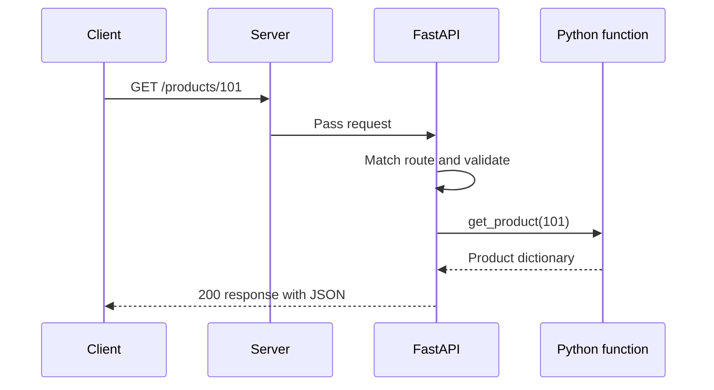

# Topic 01 — The Simplest Backend Request

> **Single learning goal:** Trace one request from a client to a FastAPI function and back as a response.

## 🌱 Start with the Problem

Imagine a shopping application. The screen needs the details of product `101`.

The client could store every product permanently inside the application, but that quickly creates problems:

- Product details can change.
- Many users need the same current data.
- The business must control which data is returned.

So the shared logic and data access live in a **backend**.

For now, think of the backend as a Python program that:

1. Keeps running.
2. Waits for requests.
3. Runs the correct function for each request.
4. Sends a response.

That is the only mental model we need for this lesson.

---

## 👥 The Three Parts

### 1. Client

The client asks for something. It could be:

- A browser
- A mobile application
- Postman
- Another backend service

### 2. Server

The server is the running backend program. In a FastAPI project, a server program such as Uvicorn listens for incoming requests and passes them to FastAPI.

### 3. Request and response

The client sends an HTTP **request**. The server processes it and sends an HTTP **response**.

```text
Client  ───── request ─────▶  Backend
Client  ◀──── response ───── Backend
```

HTTP is simply the agreed format the client and server use to communicate.

---

## 📍 The Address of an Endpoint

Suppose the client calls:

```text
http://127.0.0.1:8000/products/101
```

| Part | Meaning |
|---|---|
| `http` | Communication protocol |
| `127.0.0.1` | Host—the machine running the server |
| `8000` | Port—the specific entry point used by the server program |
| `/products/101` | Path—the resource the client wants |

An **endpoint** is a combination of an HTTP method and a path.

```text
GET /products/101
```

`GET /products/101` and `DELETE /products/101` are different endpoints because their methods are different.

---

## ✉️ What Is Inside a Request?

For this lesson, a request has four useful parts:

| Part | Purpose | Example |
|---|---|---|
| Method | Describes the intended action | `GET` |
| Path | Identifies the target | `/products/101` |
| Headers | Carry extra information | `Accept: application/json` |
| Body | Carries input data when needed | Common with `POST` |

A simple `GET` request usually does not need a body.

---

## 🐍 The FastAPI Endpoint

```python
from fastapi import FastAPI, HTTPException

app = FastAPI()

products = {
    101: {"id": 101, "name": "Mechanical Keyboard", "price": 4500}
}

@app.get("/products/{product_id}")
def get_product(product_id: int):
    product = products.get(product_id)

    if product is None:
        raise HTTPException(status_code=404, detail="Product not found")

    return product
```

Let us follow this code without introducing any architecture patterns.

### Step 1: the client sends a request

```http
GET /products/101
```

### Step 2: FastAPI finds a matching route

This decorator registers the route:

```python
@app.get("/products/{product_id}")
```

It means:

- Accept the `GET` method.
- Match a path shaped like `/products/some-value`.
- Pass that value to `get_product` as `product_id`.

### Step 3: FastAPI validates the input

The annotation says `product_id` must be an integer:

```python
product_id: int
```

FastAPI converts the text `"101"` from the URL into the integer `101`.

If the client calls `/products/abc`, conversion fails. FastAPI returns a validation error without running the function body.

### Step 4: Python runs the function

```python
product = products.get(product_id)
```

For now, the data comes from a Python dictionary. A database will be introduced later, after this request flow is clear.

### Step 5: the function returns a Python value

```python
return product
```

FastAPI converts the dictionary into JSON and builds the HTTP response.

---

## 📤 What Is Inside a Response?

A response contains:

| Part | Purpose | Example |
|---|---|---|
| Status code | Describes the outcome | `200` |
| Headers | Describe the response | `Content-Type: application/json` |
| Body | Contains the returned data | Product JSON |

For product `101`, the response is approximately:

```http
HTTP/1.1 200 OK
Content-Type: application/json

{
  "id": 101,
  "name": "Mechanical Keyboard",
  "price": 4500
}
```

If the client asks for product `999`, our function raises an `HTTPException` and the response becomes:

```http
HTTP/1.1 404 Not Found

{
  "detail": "Product not found"
}
```

The status code and body tell the client what happened.

---

## 🔄 The Complete Flow



The important point is not memorizing the boxes. It is seeing that a FastAPI endpoint is ordinary Python code connected to HTTP through routing, validation, and response conversion.

---

## 🧠 One Technical Lead Habit

Before discussing folders, databases, queues, or scaling, a Technical Lead should be able to trace the simplest successful request:

```text
Who sends it?
→ Which endpoint matches it?
→ How is input validated?
→ Which Python function runs?
→ What response is returned?
```

More advanced designs are extensions of this flow. We will introduce them only when the simple version develops a real limitation.

---

## 📖 Small Glossary

| Term | Simple meaning |
|---|---|
| Client | Program that sends a request |
| Server | Running program that waits for requests |
| HTTP | Communication format used by client and server |
| Endpoint | HTTP method plus path |
| Route | Mapping from an endpoint to a function |
| Response status | Number describing the request outcome |
| JSON | Text format commonly used for API data |

---

## ✅ Check Your Understanding

Using only this lesson, try to answer:

1. What is the difference between a client and a server?
2. Why are `GET /products/101` and `DELETE /products/101` different endpoints?
3. What happens when `/products/abc` is called?
4. How does the returned Python dictionary become an HTTP response?

If any answer is unclear, revisit only that section.

---

## 🛑 Intentional Stop Point

This lesson does **not** cover:

- Databases
- Application layers
- `async` and `await`
- Threads or processes
- Background workers or queues
- Idempotency
- Scaling

Those concepts will appear later, one at a time, when the simple application gives us a reason to need them.

## ➡️ Next Topic

The next topic will ask: **what happens when an endpoint grows beyond one small function?**

That problem will naturally lead us to separating routing, business logic, and data access.
