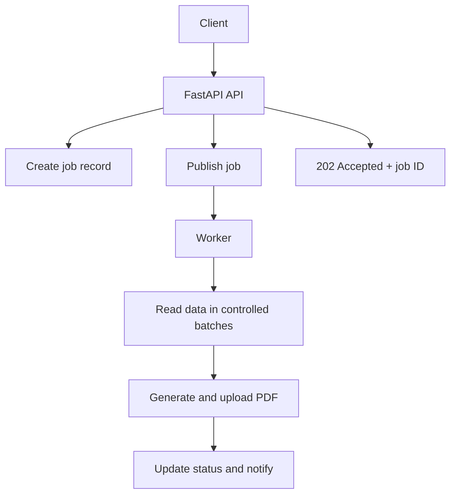

# How a Production Backend Processes a Request

> **Tier A Notes** — Backend Engineering / Topic 01

## 🎯 Why We Start Here

You already know how to write a FastAPI endpoint. The next step is understanding what that endpoint should—and should not—be responsible for.

Consider an endpoint that generates a large report:

```http
POST /reports
```

A first implementation might validate the input, query PostgreSQL, generate a PDF, upload it to GCS, send an email, and finally return a response.

It works locally. In production, it starts timing out, creating duplicate reports, overloading the database, and losing work during deployments.

The problem is not FastAPI syntax. The problem is that work with very different characteristics has been placed inside one HTTP request.

---

## 🕰️ The Request Clock and the Job Clock

An HTTP request lives on the **request clock**. Clients, gateways, load balancers, and servers all expect a response within a limited time.

Report generation lives on the **job clock**. It may take seconds or minutes, require retries, consume heavy CPU, and need to survive a pod restart.

When job-clock work is forced into the request clock, production failures appear:

- The client or gateway times out while the server is still working.
- A retry starts the same work again.
- Each long request occupies application capacity.
- A restart destroys unfinished in-process work.
- Scaling the API also unintentionally scales heavy processing.

A Technical Lead separates these clocks.

---

## 🚶 The Normal Path of a Short Request

A production request usually moves through several boundaries:

```text
Client
  → Load balancer / API gateway / ingress
  → ASGI server
  → FastAPI router
  → Application service
  → Repository or external service
  → Response
```

Each boundary has a different responsibility.

### API layer

- Understand HTTP.
- Authenticate and authorize the caller.
- Validate request shape.
- Call one application use case.
- Translate results and errors into an HTTP response.

### Application/service layer

- Orchestrate the business use case.
- Apply workflow rules.
- Control transaction boundaries.
- Call repositories, queues, and external-service interfaces.

### Repository/data-access layer

- Hide persistence details from business logic.
- Execute queries and map stored data.
- Avoid leaking ORM operations throughout the application.

### Infrastructure layer

- Implement access to PostgreSQL, Redis, queues, GCS, email, and other external systems.

The router should be thin. A thin router is not the objective by itself; it is the result of keeping HTTP concerns separate from application decisions.

---

## 🧮 Classify the Work Before Choosing a Tool

Three questions guide the execution model:

1. **How long can this work take?**
2. **Is it waiting for I/O or consuming CPU?**
3. **Must it survive process or pod failure?**

| Work | Character | Typical choice |
|---|---|---|
| Validate a small request | Fast CPU work | Execute in request |
| Query through an async database driver | I/O-bound waiting | `asyncio` |
| Call an async HTTP service | I/O-bound waiting | `asyncio` |
| Call a blocking legacy SDK | Blocking I/O | Thread, or replace the SDK |
| Generate a CPU-heavy PDF | CPU-bound | Separate worker process |
| Send a critical email | Durable side effect | Queue and worker |
| Record a tiny non-critical metric | Short best-effort work | Possibly in-process background task |
| Generate a 30-second report | Long and retryable | Durable queue and worker |

### `asyncio`

`asyncio` helps one thread make progress on other tasks while a task is **waiting** for non-blocking I/O. It does not make CPU-heavy Python work run faster.

If CPU-heavy PDF generation runs directly inside an async endpoint, it blocks the event-loop thread and delays unrelated requests.

### Threads

Threads are useful when code waits on blocking I/O and the library does not provide an async interface. They are normally not the first choice for CPU-heavy Python because of the GIL.

### Processes

Separate processes can execute CPU-heavy Python in parallel because each process has its own interpreter and GIL. A worker service or process pool can therefore isolate PDF generation from API request handling.

### FastAPI `BackgroundTasks`

`BackgroundTasks` runs work in the same application process after the response is sent. It is suitable only for small, non-critical work.

It is not a durable job system:

- Work can disappear when the pod restarts.
- It has no built-in distributed coordination.
- Retry and dead-letter handling are limited or absent.
- CPU-heavy work still competes with API capacity.

### Message queue

A queue separates request acceptance from durable processing. It supports independent scaling, retries, buffering during load spikes, and worker recovery.

A queue does not automatically prevent duplicates. Most delivery systems can deliver a message more than once, so consumers must be idempotent.

---

## 🏗️ A Better Report-Generation Flow



The request path becomes:

1. Validate and authorize the request.
2. Accept an `Idempotency-Key` or derive a safe business key.
3. Create a report job with status `PENDING`.
4. Publish work for a separate worker.
5. Return `202 Accepted` with the job ID and status URL.

```http
HTTP/1.1 202 Accepted
Location: /reports/jobs/8e17...

{
  "job_id": "8e17...",
  "status": "PENDING"
}
```

The worker then:

1. Claims the job safely.
2. Moves it to `PROCESSING`.
3. Reads database data in bounded pages or streams.
4. Generates and uploads the report.
5. Moves the job to `SUCCEEDED` with the object location.
6. Publishes or sends the notification.
7. Records failure details and retry state when something goes wrong.

### An important production detail

Creating the database record and publishing the message are two separate operations. If the database commit succeeds but publishing fails, the job can remain stuck.

A common later-stage solution is the **transactional outbox pattern**: save the job and an outbox event in one database transaction, then have a publisher reliably deliver the event. We will derive this pattern properly in the messaging module.

---

## 🔁 Preventing Duplicate Work

Client retries and queue redelivery are normal. The system must make repeating the same request safe.

A basic idempotency design:

1. The client sends an `Idempotency-Key`.
2. Store it with the caller identity, request fingerprint, and result.
3. Add a database unique constraint on the appropriate key.
4. If the same request arrives again, return the existing job instead of creating another.

Do not rely only on an application-level “check then insert”: two replicas can check simultaneously and both see no record. The database unique constraint provides the final concurrency-safe guard.

The worker also protects state transitions. For example, it should claim only a job currently in `PENDING`, using an atomic conditional update or suitable locking.

Idempotency is not simply “ignore duplicates.” It means repeating an operation produces the same intended business effect.

---

## 🐢 Investigating Database Slowdown

A Technical Lead does not begin with “add a cache” or “increase the database size.” First locate the bottleneck.

### 1. Measure the actual query

- Which endpoint and query are slow?
- Is latency in acquiring a connection, executing SQL, transferring rows, or converting ORM objects?
- How do p50, p95, and p99 latency change under load?

### 2. Inspect the execution plan

Use the database execution plan—commonly `EXPLAIN` or `EXPLAIN ANALYZE`—to find:

- Full-table scans
- Missing or ineffective indexes
- Expensive joins or sorts
- Incorrect row estimates
- Too many rows being read

### 3. Check application query behaviour

- N+1 ORM queries
- Fetching unused columns
- Unbounded result sets
- Missing pagination or batching
- Repeating the same query

### 4. Check transactions and locks

- Long-running transactions
- Lock waits or deadlocks
- An isolation level stronger than required
- Multiple workers updating the same rows

### 5. Check the connection pool

Sometimes the query is fast but requests wait for a connection because the pool is exhausted. Increasing the pool blindly can overload PostgreSQL further; API concurrency, worker concurrency, and database capacity must be designed together.

---

## 🗂️ A Practical Component Structure

```text
app/
├── api/
│   ├── routes/
│   │   └── reports.py
│   └── schemas/
├── application/
│   └── report_service.py
├── domain/
│   └── report_job.py
├── repositories/
│   └── report_repository.py
├── infrastructure/
│   ├── database/
│   ├── messaging/
│   ├── storage/
│   └── email/
├── workers/
│   └── report_worker.py
└── main.py
```

This is a starting model, not a structure to copy mechanically. A small service may not need every directory. The design should expose meaningful boundaries without creating empty abstractions.

Dependencies should generally point inward:

- API depends on the application use case.
- Application logic depends on interfaces or contracts.
- Infrastructure provides concrete implementations.
- Business rules do not import FastAPI, SQLAlchemy, GCS, or a queue SDK unless there is a deliberate reason.

---

## 🧠 Technical Lead Decision Checklist

Before approving a backend flow, ask:

- What must finish before we respond?
- What can fail independently?
- Must the work survive a restart?
- Is the work I/O-bound or CPU-bound?
- What happens when the client retries?
- What happens when the queue redelivers?
- Where is the transaction boundary?
- Can two replicas execute this concurrently?
- How are timeout, retry, and cancellation handled?
- How will we observe latency, failure, backlog, and saturation?
- What is the simplest design that meets the actual requirements?

---

## ✅ What You Should Retain

1. An HTTP endpoint is an adapter, not the entire application.
2. Separate short request work from long durable job work.
3. `asyncio` improves I/O concurrency; it does not accelerate CPU-heavy Python.
4. Threads, processes, in-process background tasks, and queues solve different problems.
5. Critical long-running work belongs in a durable worker architecture.
6. Retries require idempotency at both API and consumer boundaries.
7. Database diagnosis starts with measurement, query plans, locks, and pool behaviour—not guesses.
8. A Technical Lead connects application design to failure handling and production operation.

## ➡️ After These Notes

Once this mental model is clear, the topic continues with:

- `Interview.md` — explanation checks, design questions, and common mistakes
- `Hands_On/` — refactor a blocking report endpoint into a job-based architecture

The next deeper topics will separately derive HTTP lifecycle, FastAPI architecture, concurrency, database engineering, and messaging.
